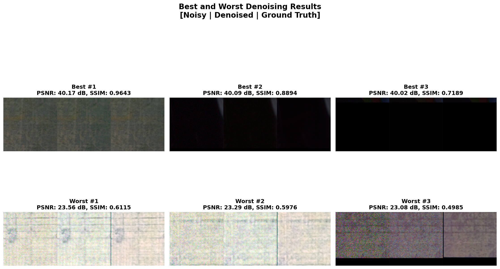

# Image Denoising with U-Net

Deep learning-based image denoising using a lightweight U-Net architecture trained on real smartphone camera noise. Achieved 33.95 dB average PSNR with targeted data augmentation to address class imbalance.


*Best denoising results (top row) and most challenging cases (bottom row) from test set*

## Key Results

| Metric | Value |
|--------|-------|
| **Average PSNR** | 33.95 dB |
| **Average SSIM** | 0.8538 |
| **Worst Case PSNR** | 23.08 dB |
| **Best Case PSNR** | 40.17 dB |
| **Standard Deviation** | 3.33 dB |

### Major Achievement
**Worst case improvement:** Bright/colourful images improved from 17-18 dB (baseline) to 23+ dB through targeted preprocessing augmentation — a **+6 dB gain** on previously failing cases.

## Quick Start

### Installation
```bash
# Clone repository
git clone https://github.com/kimbielby/Image-Denoising.git
cd image-denoising

# Create virtual environment
python -m venv venv
source venv/bin/activate  # On Windows: venv\Scripts\activate

# Install dependencies
pip install -r requirements.txt
```

### Dataset Setup 
1. Download the [Smartphone Image Denoising Dataset](https://www.kaggle.com/datasets/rajat95gupta/smartphone-image-denoising-dataset) from Kaggle
2. Extract the dataset
3. Place the image directories in `data/images/og_images/`
    - Should contain subdirectories with GT (ground truth) and NOISY image pairs 

Your directory structure should look like:
```
data/
└── images/
└── og_images/
├── 0001_001_S6_00100_0060_3200_L/
│   ├── GT_SRGB_010.PNG
│   └── NOISY_SRGB_010.PNG
├── 0002_001_S6_00100_00020_3200_N/
└── ...
```

### Training
```bash
# Train with default configuration
jupyter notebook notebooks/01_training.ipynb

# Or use the training pipeline directly
python -c "from pipelines import run_training_pipeline; from configs import load_config; config = load_config('configs/default.yaml'); run_training_pipeline(config)"
```

### Pre-trained Model

Download the pre-trained model from [Releases](https://github.com/kimbielby/Image-Denoising/releases/latest):

**Option 1: Manual Download**
1. Go to [Releases](https://github.com/kimbielby/Image-Denoising/releases/latest)
2. Download `best_model.pth` (~30 MB)
3. Place in `runs/best_model.pth`

**Option 2: Command Line**
```bash
# Using wget
wget https://github.com/kimbielby/Image-Denoising/releases/download/v1.0/best_model.pth -O runs/best_model.pth

# Or using curl
curl -L https://github.com/kimbielby/Image-Denoising/releases/download/v1.0/best_model.pth -o runs/best_model.pth
```

**Usage:**
```python
from models import UNet
from utils.checkpoint_utils import load_checkpoint_inference

# Load pre-trained model
model = UNet(in_channels=3, out_channels=3, init_features=32)
model = load_checkpoint_inference("runs/best_model.pth", model, device="cuda")
```

### Inference
```bash
# Denoise a single image
jupyter notebook notebooks/03_inference.ipynb
```

## Project Highlights

### The Challenge 
   - Initial training on 5,922 image pairs achieved 32.87 dB average PSNR
   - Worst cases were all bright/colourful images which scored 17 - 18dB
   - Root cause analysis revealed severe class imbalance: only 5.6% of training data consisted of bright images

### Solution: Targeted Preprocessing Augmentation
   - Created 5× geometric augmentations (flips, rotations) for each bright image
   - Increased bright image representation from 5.6% → 24% of training data
   - Result: Worst cases improved to 23+ dB (+6 dB improvement) and average performance was 33.95 dB

### Additional Experiments 
**Runtime ColorJitter Augmentation** 
   - Attempted runtime colour augmentation to increase data diversity
   - Even with conservative settings (brightness=0.2, contrast=0.2) and clamping, this caused training divergence at epochs 4-7 across multiple runs 
   - Preprocessing augmentation proved more stable

**CombinedLoss (MSE + SSIM)** 
   - Looked into perceptual loss combining MSE and SSIM for better texture preservation
   - Required a significantly lower learning rate (3e-5 vs 1e-4) and showed training instability
   - MSELoss was chosen for production reliability 

## Architecture

**Lightweight U-Net** (7.77M parameters, ~30 MB)
- 4-level encoder-decoder with skip connections
- DoubleConv blocks (Conv → BatchNorm → ReLU × 2)
- MaxPool2D for downsampling
- ConvTranspose2D for upsampling
- Input/Output: RGB images (512×512 patches)

```
Input (3, 512, 512)
    ↓ encoder1 (32 features)
    ↓ pool → encoder2 (64 features)
    ↓ pool → encoder3 (128 features)
    ↓ pool → encoder4 (256 features)
    ↓ pool → bottleneck (512 features)
    ↓ upconv + skip → decoder4 (256 features)
    ↓ upconv + skip → decoder3 (128 features)
    ↓ upconv + skip → decoder2 (64 features)
    ↓ upconv + skip → decoder1 (32 features)
    ↓ 1×1 conv
Output (3, 512, 512)
```

See [models/model.py](models/model.py) for implementation details.

## Key Findings

### 1. Data Analysis
- Initial training achieved good average metrics (32.87 dB) but had severe outliers (17-18 dB)
- Root cause analysis revealed bright images were underrepresented in training data

### 2. Targeted Augmentation vs Random Augmentation
- Targeted approach: 5× augmentation of specifically bright images improved the worst cases by 6 dB
- Random approach: ColorJitter applied on all bright images caused training divergence

### 3. Stability vs Theoretical Optimality
- CombinedLoss (MSE + SSIM) should theoretically preserve textures better, but in practice it caused training instability even with careful tuning
- MSELoss however provided stable training with good results

### 4. Early Stopping
- Model peaked at different epochs across runs (epoch 15-30 typically)
- Early stopping with patience=15 prevented overfitting
- Validation every epoch (not every 10 as was originally set) provided better model selection

For detailed analysis, see [RESULTS.md](RESULTS.md).

## Project Structure

```
image-denoising/
├── configs/
│   ├── config.py                 # Configuration dataclasses and loader
│   └── default.yaml              # All hyperparameters and settings
├── data/
│   └── images/
│       └── og_images/            # Place downloaded dataset here
├── dataloaders/
│   ├── collate.py                  # Batch collation
│   └── dataloader.py            #  Dataset and DataLoader
├── inference/
│   └── inference.py              # Inference pipeline for new images
├── models/
│   ├── losses.py                  # Custom loss functions (CombinedLoss)
│   ├── model.py                  # U-Net architecture
│   ├── test.py                     # Testing and evaluation 
│   ├── train.py                     # Training loop with early stopping
│   └── validate.py                # Validation function
├── notebooks/
│   ├── 01_training.ipynb         # Interactive training
│   ├── 02_evaluation.ipynb       # Results analysis
│   └── 03_inference.ipynb        # Inference demo
├── pipelines/
│   ├── complete.py               # End-to-end workflow
│   ├── inference_pipeline.py     # Production inference
│   ├── testing_pipeline.py       # Evaluation workflow
│   └── training_pipeline.py      # Training workflow
├── preprocessing/
│   ├── augment_inplace.py        # Targeted bright image augmentation
│   ├── crop_images.py            # Image patching (512×512)
│   └── dataset_split.py          # Train/val/test split
├── utils/
│   ├── analysis.py               # Data analysis utilities
│   ├── checkpoint_utils.py       # Model checkpoint management
│   ├── evaluation.py             # Evaluation metrics and reporting
│   ├── general.py                # General utility functions
│   ├── metrics.py                # PSNR and SSIM calculation
│   ├── reading_in.py             # Image file loading
│   ├── save_results.py           # Results serialization
│   ├── save_visualisations.py    # Save all plots
│   └── visuals.py                # Plotting and visualization
├── imports.py                    # Centralized imports
├── LICENSE                       # MIT License
├── README.md                     # This file
├── requirements.txt              # Python dependencies
└── RESULTS.md                    # Detailed analysis and findings
```

## Configuration

All hyperparameters are configurable via YAML:

```yaml
# configs/default.yaml
model:
  in_channels: 3
  out_channels: 3
  init_features: 32

loss:
  name: MSELoss        # or CombinedLoss
  alpha: 0.8           # for CombinedLoss

train:
  learning_rate: 1e-4
  epochs: 200
  batch_size: 16
  patience: 15         # early stopping

preprocessing:
  bright_threshold: 200.0
  bright_copies: 5     # augmentation multiplier for bright images
  random_augment: 50   # additional random augmentations
```

See [configs/default.yaml](configs/default.yaml) for all options.

## Dataset

**Source**: [Smartphone Image Denoising Dataset](https://www.kaggle.com/datasets/rajat95gupta/smartphone-image-denoising-dataset)

**Preprocessing**:
- Images cropped into 512×512 patches with padding
- Split: 70% train, 20% validation, 10% test
- Targeted augmentation: 5× copies of bright images (flips, rotations)
- Total training patches: 6,142 (after augmentation)

**Statistics**:
- Training: 6,142 image pairs
- Validation: 1,692 image pairs
- Test: 846 image pairs

## Training Details

- **Optimizer**: Adam
- **Learning Rate**: 1e-4
- **Scheduler**: ReduceLROnPlateau (factor=0.5, patience=5)
- **Early Stopping**: Patience=15 epochs on validation loss
- **Mixed Precision**: Enabled (CUDA only)
- **Gradient Clipping**: Max norm = 1.0
- **Validation**: Every epoch
- **Hardware**: NVIDIA GPU with 4-8GB VRAM

## References

- **U-Net Architecture**: Ronneberger et al., "U-Net: Convolutional Networks for Biomedical Image Segmentation" (2015)
- **Dataset**: [Smartphone Image Denoising Dataset](https://www.kaggle.com/datasets/rajat95gupta/smartphone-image-denoising-dataset)
- **SSIM Loss**: Wang et al., "Image Quality Assessment: From Error Visibility to Structural Similarity" (2004)

## License

MIT License - [LICENSE](LICENSE)

## Author

Kim Bielby  
[GitHub](https://github.com/kimbielby) | [LinkedIn](https://linkedin.com/in/kimbielby)

## Acknowledgments

- Dataset provided by Rajat Gupta on Kaggle

---

